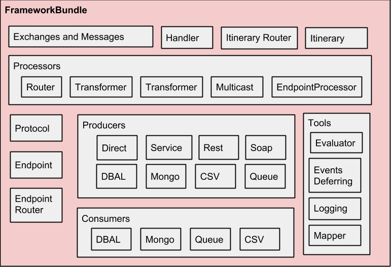

# Installation and Setup Guide for the Smartbox Integration Framework bundle

### Preface
This guide will cover the basic setup to get your Symfony project using the Smartbox Integration Framework Bundle.
There are many different ways that one can configure the bundle and also many different alternatives to the software that we will use in this configuration. 
So, for example, you may choose to use MongoDB instead of MySql, or Active MQ instead of RabbitMq. 
This setup guide is not intended to be exhaustive, but instead, just a quick setup guide.
More documentation will be added in time to explore connecting to different systems. 


### Quick overview of the Enterprise Service Bus
An Enterprise Service Bus(ESB) is the living embodiment of Enterprise Integration Patterns, 
a software architecture that facilitates disparate applications and services to interconnect. 
Created at Smartbox Group Ireland as part of a large scale integrations project, 
the "Smartbox Integration Framework Bundle" is a Symfony bundle that provides much of the functionality required for an ESB.
At it's most basic, this system acts as a communications facilitator. 

So, for example, if we have a system that uses SOAP to communicate with other systems but we want it to talk to another system that accepts JSON through it's API endpoints then we can use our ESB to allow them to communicate together. 
Even if the communications are synchronous or asynchronous our ESB can still facilitate the passing of "Messages" between the two systems.
We can make this happen by defining flows that represent incoming and outgoing communications channels. 
To expand on our example, say we want one system to broadcast to multiple systems, all of which require data structure in a different format, an ESB makes this very easy.

The Smartbox Integration Framework comprises of the following components:




    
It is not the purpose of this document to fully explain integration patterns or how an ESB works, but instead to get you up and running quickly.
For further reading on Enterprise Integration Patterns please visit <https://www.enterpriseintegrationpatterns.com/>.


## Configure

To get the framework up and running we will make the following assumptions regarding software that we will be using:
* Queuing system : RabbitMq
* Database: MySql
* Process Control: Supervisor
* WebServer: Apache + PHP 7.0


### Composer Dependencies
To simplify our setup we will install all the related Smartbox bundles
Add the following to composer.json and run ```composer install```

```yaml

"smartbox/core-bundle": "^1.0.0",
"smartbox/integration-framework-bundle": "^1.20.4",
"smartbox/camel-config-bundle": "^1.0.0",
"smartbox/besimple-soap": "^1.1.1"
```

### Main configuration

Add the following to your ``` app/config/config.yml```

```yaml

#Smartbox core configuration
smartbox_core:
    cache_drivers:
        null:
            service: ~
#    fixtures_path: "%kernel.root_dir%/JsonFixtures"
#    entities_namespaces:
#        - 'Smartbox\Integration\Framework\Entity'

smartbox_integration_framework:
    defer_events_to_uri: "queue://events"
    queue_drivers:
        main:
            type: RabbitMQ
            description: RabbitMQ queue driver
            host: "%rabbitmq.hostname%"
            username: "%rabbitmq.username%"
            password: "%rabbitmq.password%"
            format: json
            vhost: '%rabbitmq.vhost%'
            timeout: '%rabbitmq.timeout%'
        rabbitmq:
            type: RabbitMQ
            description: RabbitMQ queue driver
            host: "%rabbitmq.hostname%"
            username: "%rabbitmq.username%"
            password: "%rabbitmq.password%"
            format: json
            vhost: '%rabbitmq.vhost%'
            timeout: '%rabbitmq.timeout%'

    nosql_drivers: ~

    default_queue_driver: main
    default_nosql_driver: ~

    message_handlers:
        sync:
            description: Message hanlder to handle messages comming from the API
            retries_max: 5
            retry_delay: 0
            failed_uri: queue://main/sync/failed
            retry_uri: queue://main/sync/retry
            throw_exceptions: true
            defer_new_exchanges: true

        async:
            description: Message hanlder to handle messages comming from a queue
            retries_max: 5
            retry_delay: 0
            failed_uri: queue://main/async/failed
            retry_uri: original
            throw_exceptions: false
            defer_new_exchanges: true
            throttle_delay: 1
            throttle_delay_factor: 1
            throttle_strategy: fixed
            throttle_uri: queue://main/throttlerAsync

    flows_version: 0
    queues_default_persistence: false
    enable_logging: true
    errors_log_level: debug
    events_log_level: info
    #queues_default_ttl
    #defer_events_to_uri
    latest_flows_version: 0
    enable_events_deferring: true


smartbox_integration_camel_config:
    flows_directories:
      - "%flows_path%"
    frozen_flows_directory: "%frozen_flows_path%"

```

For ``` app/config/config_test.yml``` we need to add references to the fake handlers for SOAP and REST for testing purposes.

```yaml

parameters:
    external_system_responses_cache_dir: "%kernel.root_dir%/Resources/ExternalSystemsResponsesCache"
    fake_soap_client.class: Smartbox\Integration\FrameworkBundle\Tools\MockClients\FakeSoapClient
    fake_rest_client.class: Smartbox\Integration\FrameworkBundle\Tools\MockClients\FakeRestClient

```


### Required Parameters

Add the following to your ``` app/config/parameters.yml.dist```

```yaml

    host: localhost
    flows.version: 0
    rabbitmq.hostname: 'tcp://localhost:61613'
    rabbitmq.username: mel
    rabbitmq.password: mel
    rabbitmq.vhost: /
    rabbitmq.timeout: 15
    smartbox.queues.driver: rabbitmq
    smartbox.queues.retry: retry
    smartbox.queues.throttle: throttle
    queues.driver: '%smartbox.queues.driver%'
    queues.retry: '%smartbox.queues.retry%'
    queues.throttle: '%smartbox.queues.throttle%'

```

### Directories Required
For our sample setup we will create the following directory structures. 

 ``` app/config/flows``` This is where the flow XML documents will go. These are Camel xml configuration files.

``` app/config/frozen_flows``` Versions of the flows will be stored here when "frozen".

Both of the directories above are are required. You can create them elsewhere if you like but be sure to update them in parameters.yml.

```app/config/producers``` Will contain YAML configuration files for any producers we have. 


### Routing Endpoints
``` app/config/routing_endpoints_dev.yml```

``` app/config/routing_endpoints_prod.yml```

``` app/config/routing_endpoints_test.yml```

Sample content for these would look like this:

```yaml

queues.main:
  pattern: "queue://main/{queue}"
  defaults:
    _protocol: @smartesb.protocols.queue
    prefix: ""
    queue_driver: '%smartbox.queues.driver%'
  requirements:
    queue: "[a-zA-Z0-9/]+"
    queue_driver: "[a-zA-Z0-9]+"

service:
  path: "service://{service}/{method}"
  defaults:
    _protocol: "@smartesb.protocols.service"
  requirements:
    service: "[a-zA-Z0-9/_.-]+"
    method: "[a-zA-Z0-9_]+"

direct:
  path: "direct://{path}"
  defaults:
    _protocol: "@smartesb.protocols.direct"
  requirements:
    path: "[a-zA-Z0-9/_]+"

external_systems:
    resource: routing_external_systems.yml
    defaults:
    requirements:
      method: "[a-zA-Z0-9]+"

```


### Routing External Systems
``` app/config/routing_external_systems.yml```

And content for this file might look as follows:
```
remote_system_api:
  path: "rest://remote_system_api/{method}"
  defaults:
    _protocol: @smartesb.protocols.configurable.rest
    _producer: @smartesb.producers.remote_system_api

```
This would define routing for a rest producer that will route via matching against: ```rest://remote_system_api/{method}```
This is referenced in the ``` app/config/routing_endpoints_*.yml``` files, see above for example.

### Example flow

```xml

<?xml version="1.0" encoding="UTF-8"?>
<beans xmlns="http://www.springframework.org/schema/beans" xmlns:xsi="http://www.w3.org/2001/XMLSchema-instance" xmlns:camel="http://camel.apache.org/schema/spring" xsi:schemaLocation="http://www.springframework.org/schema/beans http://www.springframework.org/schema/beans/spring-beans.xsd http://camel.apache.org/schema/spring http://camel.apache.org/schema/spring/camel-spring.xsd">

    <camelContext trace="false" xmlns="http://camel.apache.org/schema/spring">
        <route>
            <from uri="queue://main/ping"/>
            <to uri="rest://remote_system_api/sendPingMessage" />
        </route>
    </camelContext>
</beans>

```

### Producers

Here we will add a REST producer to demonstrate what is needed to get that up and running. 

The configuration for the producer will be in ``` app/config/producers/remote_system_api.yml``` and would look something like this:

```yaml

services:
    smartbox.clients.rest.remote_system_api:
        class: GuzzleHttp\Client
        arguments: [{timeout: 0, allow_redirects: false, verify: false}]
        lazy: true
        tags:
          - { name: mockable.rest_client, mockLocation: "external_system_response_cache_dir%/remoteSystemApi" }

smartbox_integration_framework:
    mappings:
        pingToRemoteApi:
            message: obj.getMessage()
            time: obj.getTimestamp()
    producers:
        remote_system_api:
            class: SmartboxSkeletonBundle\Producers\RemoteSystemApiProducer
            description: producers to connection to a remote api
            calls:
              - [setName, ['remote_system_api'] ]
              - [setHttpClient, ['@smartbox.clients.rest.remote_system_api'] ]
              - [setValidator, ['@validator']]
              - [setHydrator,['@smartcore.hydrator.group_version'] ]

            options:
                encoding: json
                base_uri: '%remote_system_api.base.uri%'
                authentication: 'none'
                username: '%remote_system_api.username%'
                password: '%remote_system_api.password%'


            methods:
                sendPingMessage:
                    description: 'Send ping to a remote api'
                    steps:
                      - define:
                          PingMessage: "eval: body"
                      - request:
                          name: sendPingMessage
                          http_method: POST
                          uri: /skeleton/web/app_dev.php/remote/pong
                          body: "eval: mapper.map(PingMessage, 'pingToRemoteApi')"
                          validations:
                              - rule: "eval: responses['sendPingMessage']['statusCode'] == 200"
                                message: "eval: 'Enexpected response from Web Api: ' ~ responses['sendPingMessage']['statusCode']"
                                recoverable: true
                                display_message: true
                    response:
                        body: "eval: responses['sendPingMessage']['body']"

```


You will need to import this in your ``` app/config/config.yml ```
```yaml

imports:
    - { resource: parameters.yml }
    - { resource: security.yml }
    - { resource: services.yml }
    - { resource: producers/remote_system_api.yml }

```

And the class referenced above on the line ``` class: SmartboxSkeletonBundle\Producers\RemoteSystemApiProducer``` will be as follows:

```php

<?php

namespace SmartboxSkeletonBundle\Producers;

use GuzzleHttp\Exception\basResponseException;
use Smartbox\Integration\FrameworkBundle\Components\WebService\Rest\RestConfigurableProducer;
use Smartbox\Integration\FrameworkBundle\Tools\SmokeTests\CanCheckConnectivityInterface;

/**
 * Class RemoteSystemApiProducer
 * @package SmartboxSkeletonBundle\Producers
 */
class RemoteSystemApiProducer extends RestConfigurableProducer implements CanCheckConnectivityInterface {

    /**
     * {@inheritdoc}
     */
    public function checkConnectivityForSmokeTest(array $config = array() ){
        //not implemented for now
    }

    /**
     * {@inheritdoc}
     */
    public static function getConnectivitySmokeTestLabels()
    {
        return 'important';
    }


}

```


## Sample Setup for System


### Webserver Setup

#### Apache, MySql and PHP Stack on Ubuntu

```bash
sudo apt-get install -y mysql-server mysql-client
sudo apt-get install -y apache2
sudo apt-get install -y php7.0 libapache2-mod-php7.0 php7.0-cli php7.0-common php7.0-mbstring php7.0-gd php7.0-intl php7.0-xml php7.0-mysql php7.0-mcrypt php7.0-zip php7.0-dev
sudo apt-get install -y php7.0-curl php7.0-xml php7.0-soap php-apcu php-apcu-bc

```


### RabbitMQ

#### RabbitMq Setup on Ubuntu

```bash 
# rabbitmq.sh
# This will:
# Setup RabbitMQ on Ubuntu
# Add an administrator called "mel" with the password "mel".
# Allow remote access to the management console.
# And finally it will add rabbitmq.local to /etc/hosts
 
sudo apt-get install rabbitmq-server
rabbitmq-plugins enable rabbitmq_management
rabbitmq-plugins enable rabbitmq_stomp
rabbitmqctl add_user mel mel
rabbitmqctl set_user_tags mel administrator
rabbitmqctl set_permissions -p / mel "." "." ".*"
sudo touch /etc/rabbitmq/rabbitmq.config
echo "[{rabbit, [{loopback_users, []}]}]." | sudo tee /etc/rabbitmq/rabbitmq.config
echo -e "\n127.0.0.1	rabbitmq.local" | sudo tee -a /etc/hosts

```


### Adding Workers with Supervisor

#### Install Supervisor on Ubuntu
```bash
sudo apt-get install supervisor
```

#### Create a worker configuration

 To create a consumer that will be controlled by supervisord, we can add a .conf file to the supervisor configurations directory. For example:
 ``` /etc/supervisor/conf.d/SuperHardWorker.conf```
 which would contain contents as follows:
 ```bash
[program:consumer_db_queue]
process_name = %(program_name)s_%(process_num)02d
autostart = true
autorestart = true
numprocs=10
directory=/var/www/skeleton/
command = php app/console smartesb:consumer:start queue://main/persist --killAfter=200
stdout_logfile = /home/mel/stdout.log
stderr_logfile = /home/mel/stderr.log
startretries = 10
user = mel
 ```
Note that the value ```numprocs=10``` means that supervisor will attempt to always run 10 instances/processes of the program.


